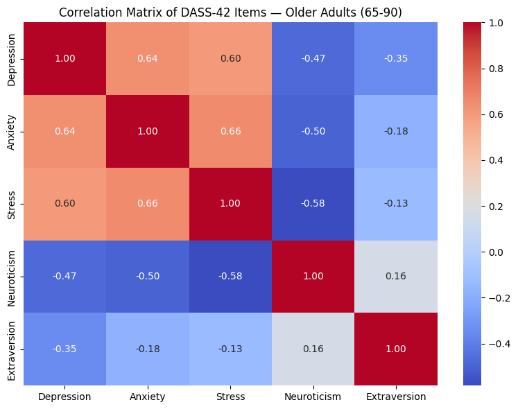

# Validating a Mental Health Measurement Tool at Scale

**What this project shows**: how to take a measurement instrument used on thousands of people, and rigorously test whether it actually measures what it claims to, across different populations — using the same statistical toolkit companies use to validate surveys, product feedback scales, and behavioral scoring models.

The dataset here is a psychological questionnaire (the DASS-42, a widely used clinical screening tool for depression, anxiety, and stress). But the underlying problem is a general one: **any organization that measures people at scale, through surveys, NPS scores, engagement indices, risk scores, or behavioral segments, needs to know whether that measurement is reliable, whether it means the same thing for every group of people, and whether it can actually predict the outcome it's meant to predict.** This project answers exactly that, end to end, on real data from ~40,000 respondents.

## Why this matters in an industry context

| What I did here | Where this shows up in industry |
|---|---|
| Tested whether a questionnaire's structure holds across two very different age groups | Checking whether a customer satisfaction survey, engagement score, or risk model means the same thing across markets, age groups, or customer segment, a common failure point in global research programs |
| Measured internal consistency and item quality (Cronbach's alpha, item-total correlation) | Auditing survey/scale quality before launch, catching redundant or noisy questions before they go into a dashboard leadership relies on |
| Built a classifier to predict a severity outcome from behavioral and demographic features | The same pipeline used for churn prediction, risk scoring, or customer segmentation, train/test split, feature importance, and honest reporting of where the model struggles |
| Reported model limitations explicitly instead of overselling accuracy | The habit that separates a report that gets trusted by decision-makers from one that gets flagged after the fact |

## What's inside

- **Confirmatory & exploratory factor analysis** (CFA/EFA) — testing whether a measurement instrument's structure holds up statistically, and adapting the model when it doesn't
- **Reliability & validity testing** — Cronbach's alpha, item-total and domain-total correlations, criterion validity against an independent measure
- **Random Forest classification** — predicting a 5-level outcome from sociodemographic and personality features, including an honest read of where the model over- and under-performs

## Research question

Does the standard three-factor structure of the DASS-42 replicate across different age cohorts, and can sociodemographic/personality variables meaningfully predict mental state severity classes?

## Data

- **Source**: [Depression Anxiety Stress Scales Responses (Kaggle)](https://www.kaggle.com/datasets/lucasgreenwell/depression-anxiety-stress-scales-responses), originally collected via [OpenPsychometrics.org](https://openpsychometrics.org/)
- **N** = 39,775 respondents, collected 2017–2019
- **Content**: 42 DASS items, 10-item TIPI (Ten-Item Personality Inventory), 16-item validity checklist, sociodemographic metadata (age, gender, education, marital status, family size, country, response times)
- **Anonymization**: fully anonymized public dataset — no personally identifiable information
- File: `data/data.csv` (tab-separated)

## Method

1. **CFA** (young adults, 20–29): confirms the original three-factor structure (Depression/Anxiety/Stress) via Maximum Likelihood estimation (`semopy`), assessed with χ², CFI, RMSEA, TLI
2. **EFA → CFA** (older adults, 65–90): exploratory factor analysis (`factor_analyzer`, ML extraction, Promax rotation) to test whether the factor structure holds in an underrepresented age group, followed by confirmatory validation
3. **Internal consistency & construct validity**: Cronbach's alpha, item-total and domain-total correlations for both cohorts
4. **Criterion validity**: correlations between DASS-42 subscales and TIPI Emotional Stability / Extraversion
5. **Random Forest classifier** (`scikit-learn`): predicts 5-level mental state severity (Normal → Extremely Severe) from sociodemographic and personality features (80/20 train-test split, 100 estimators, seed=42)

## Key results

| Cohort | CFI | RMSEA | TLI | Depression α | Anxiety α | Stress α |
|---|---|---|---|---|---|---|
| Young adults (20–29), N=15,792 | 0.89 | 0.05 | 0.89 | 0.95 | 0.91 | 0.92 |
| Older adults (65–90), N=253 | 0.89 | 0.07 | 0.88 | 0.96 | 0.88 | 0.92 |

- Both cohorts show a marginal-to-sufficient model fit and high internal consistency, but the older-adult EFA revealed item cross-loadings between the Anxiety and Stress subscales, suggesting the standard three-factor model may not generalize cleanly to elderly populations.
- The Random Forest classifier reached 0.59 overall accuracy on the 5-class severity target — well above chance for a 5-class problem, but with weak performance on the intermediate severity classes (Mild/Moderate F1 ≈ 0.32–0.45), indicating that sociodemographic and personality features alone are informative but insufficient for fine-grained severity prediction.



Full statistical detail, tables, and figures are in [`docs/report.pdf`](docs/report.pdf).

## Repository structure

```
.
├── CFA_EFA_RF_Script_Tosi.ipynb   # full analysis pipeline (CFA, EFA, RF, plots)
├── data/
│   └── data.csv                    # anonymized public dataset
├── docs/
│   └── report.pdf                  # full written report with tables and figures
├── requirements.txt
└── README.md
```

## Reproducing the analysis

```bash
pip install -r requirements.txt
jupyter notebook CFA_EFA_RF_Script_Tosi.ipynb
```

The notebook is organized into five clear sections (data loading, reusable helper
functions, young-adult CFA, older-adult EFA→CFA, Random Forest classifier) and runs
end-to-end with no errors. Mardia's multivariate normality test is run on a fixed
5,000-row subsample for memory efficiency; the full-sample result (N=15,792) is
reported in `docs/report.pdf`.

## Limitations

- The older-adult subsample is comparatively small (N=253), limiting statistical power for the EFA/CFA comparison
- Likert-type items were treated as interval-level data, consistent with common practice in DASS-42 validation literature but a simplifying assumption worth flagging
- The RF classifier's moderate performance suggests room for improvement via feature engineering, hyperparameter tuning, or alternative models, noted explicitly as a direction for future work rather than a limitation glossed over

## Author

Michele Tosi
